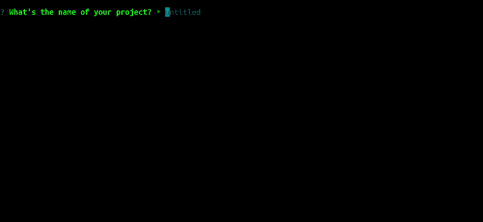

# cmake-seed

Stub a CMake-based project with X number of executables, Y number of static libs and Z number of dynamic libs.
Allows you to set up library dependencies and sets up a gtest suite with a single test for you.



## Disclaimer

1. This has only been used and tested on Linux (Debian and Ubuntu). There's no reason it *shouldn't* work on Windows and/or OSX, but it might also just break. 
   I'd be interested in feedback and/or a PR if this is the case.
   
2. This is a slightly opinionated project seeder. It stubs folders and CMakefiles in the way that we do at Decemberborn.
   If this happens to suit your needs too, perfect. 

## Dependencies

This is a Node/npm based project. Tested on node v14.15.3, but should most likely work on older version too (no guarantee HOW old though).

Also, of course, if you want to actually be able to build the generated project, make sure that CMake is installed
together with  whatever build chain makes sense for your system (Make, nmake, Visual Studio, etc.).

To install and use the project seeder, clone this repo and just run:

```
npm i
```

## Creating a new project

Simply type `npm start`. This will ask you all the questions you need, and generate the project structure.

Your apps will be in `my-project/src/apps`, libs in `my-project/src/libs` and the tests in `my-project/src/tests`.

Either open and build the project from CLion (if you selected that option), or from the commandline:

```bash
$ mkdir build && cd build # or whatever you selected your output folder to be
$ cmake ..   
```

## Contributing

Feel free to open issues, contribute through PRs etc.
